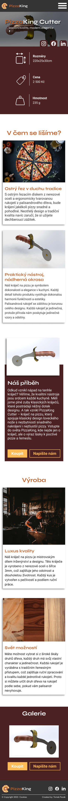
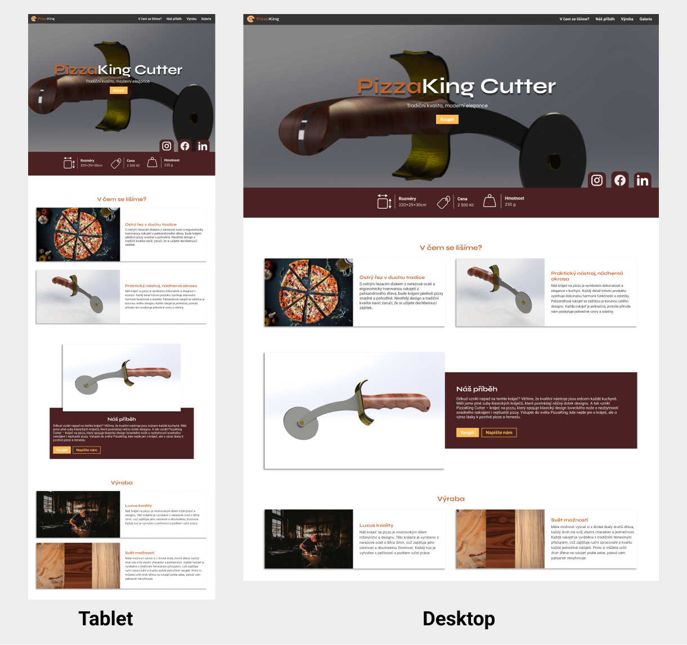

# Zadání pro cvičení na responzivní layout
Stáhněte si podkladový kód a vytvořte responzivní layout, který se přizpůsobuje různým zařízením od mobilních telefonů po desktop. U main zajistěte aby na počítačích (1200px a více) byl zobrazen přes celou obrazovku.  Zaměřte se na využití flexboxu (tam kde je potřeba). Požadovanou podobu najdete pod textem a v podkladovém kódu.

V některých místech stránky je jako textace použito Loremipsum, to nahraďte relevantním textem s pomocí AI. Využijte pro to informace dostupné ze stránky a základní informace uvedené níže. Také nezapomeňte vytvořit metadescription. Kód pište jen do layout.css a v HTML pouze nahraďte Loremipsum a vytvořte metadescription.

Základní informace o stránce
- landingpage pro kráječ na pizu, zaměřený na český trh
- vyznačuje se dřevěnou rukojetí a záštitou
- vyroben z nerezové oceli a palisandrového dřeva
- zákazník si může vybrat druh dřeva rukojeti

