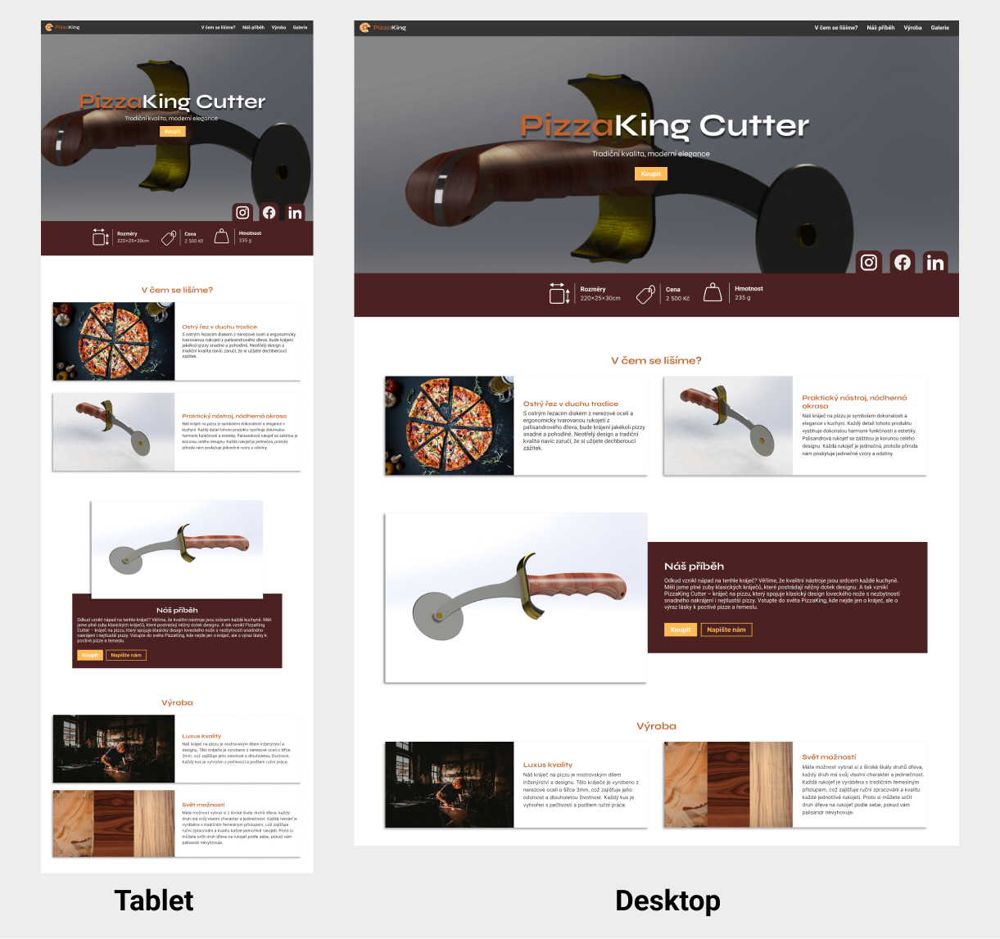

# Zadání pro cvičení na responzivní layout
Stáhněte si podkladový kód a vytvořte responzivní layout, který se přizpůsobuje různým zařízením od mobilních telefonů po desktop. Zaměřte se na využití flexboxu(tam kde je potřeba). Požadovanou podobu najdete pod textem a v podkladovém kódu.

V některých místech stránky chybí textace, tu doplňte s pomocí AI. Využijte pro to informace dostupné ze stránky a základní informace uvedené níže. Také nezapomeňte vytvořit metadescription.

Základní informace o stránce
- landingpage pro kráječ na pizu, zaměřený na český trh
- vyznačuje se dřevěnou rukojetí a záštitou
- vyroben z nerezové oceli a palisandrového dřeva

