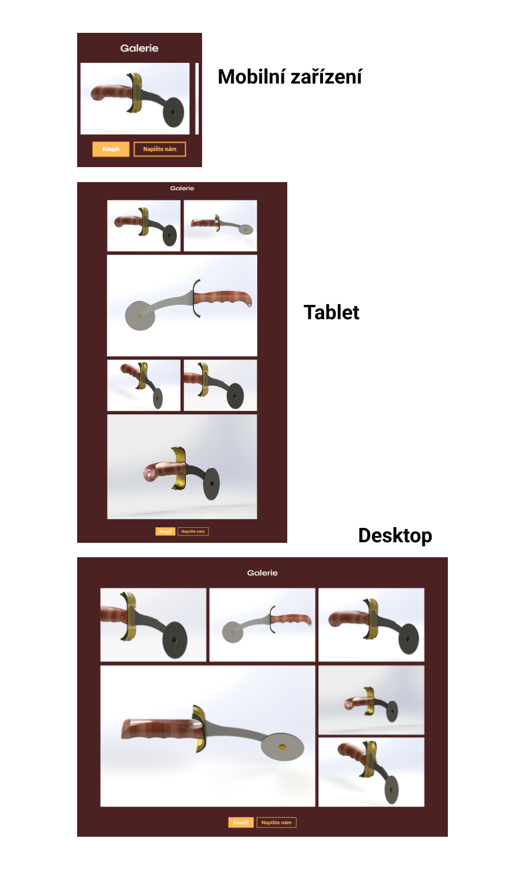

# Zadání pro cvičení na responzivní grid galerii
Stáhněte si podkladový kód a vytvořte responzivní galerii (od telofonu až po desktop) shodnou s připojenými obrázky pomocí gridu. U obrázků gItem--2, 3 a 6 v HTML dotvořte srcset a sizes. Jakýkoliv jiný zásah do HTML není potřeba. Pro mobilní zařízení se galerie zobrazuje pomocí horizontálního scrolování.
(v rámci cvičení nezáleží na přesném paddingu prvků, zvolte ho tak, aby vizuálně odpovídal řešení)

