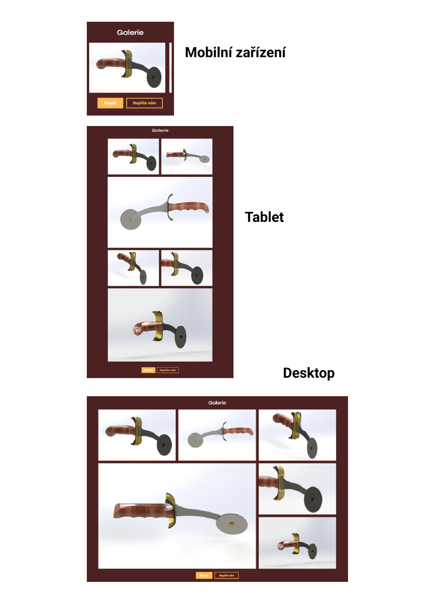

# Zadání pro cvičení na responzivní grid galerii
Stáhněte si podkladový kód a vytvořte responzivní galerii (od telofonu až po desktop) shodnou s připojenými obrázky pomocí gridu. U obrázků, které výrazně mění svou velikost vytvořte srcset. Jakýkoliv jiný zásah do HTML není potřeba. Veškeré obrázky jsou už připojené v HTML, krom těch určených pro srcset. Pro mobilní zařízení se galerie zobrazuje pomocí horizontálního scrolování.
(v rámci cvičení nezáleží na přesném paddingu prvků, zvolte ho tak, aby vizuálně odpovídal řešení)

