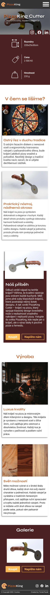

# Zadání pro cvičení na responzivní komponenty
Stáhněte si podkladový kód a dodělejte komponenty do responzivního a shodného stavu s níže přiloženými obrázky. V podkladovém kódu je HTML struktura komponent dána a není potřeba ji měnit, jediný potřebný zásah do HTML je přidání tříd, které se snažte tvořit metodou BEM. Media-queries s container-queries jsou připraveny v layout.css včetně breakpointů. V místech kde to dává smysl použijte Container queries.  Vzhled správného řešení najdete v předpřipraveném kódu ve složce reseni a pod tímto textem.

