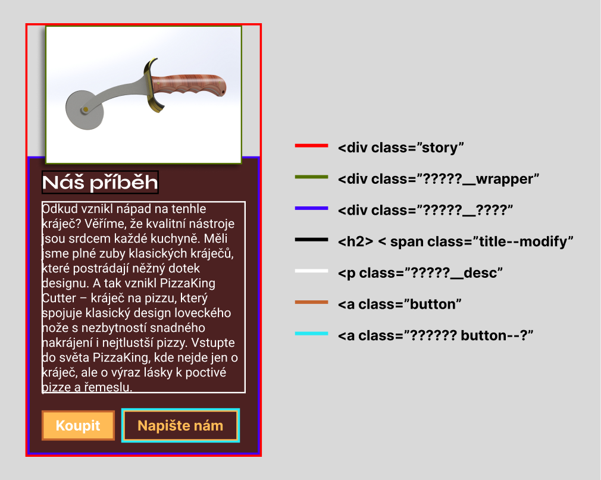

# Zadání pro cvičení na responzivní komponenty
Stáhněte si podkladový kód a dodělejte komponenty do responzivního a shodného stavu s níže přiloženými obrázky (kód pište pouze do style.css). V místech kde to dává smysl použijte Container queries.
V podkladovém kódu je HTML struktura komponent dána a není potřeba ji měnit, jediný potřebný zásah do HTML je vytvoření prostřední komponenty, zobrazené níže, krom HTML struktury je potřeba i správně přidat třídy dle metodologie BEM. Vzhled správného řešení najdete v předpřipraveném kódu a pod tímto textem.

