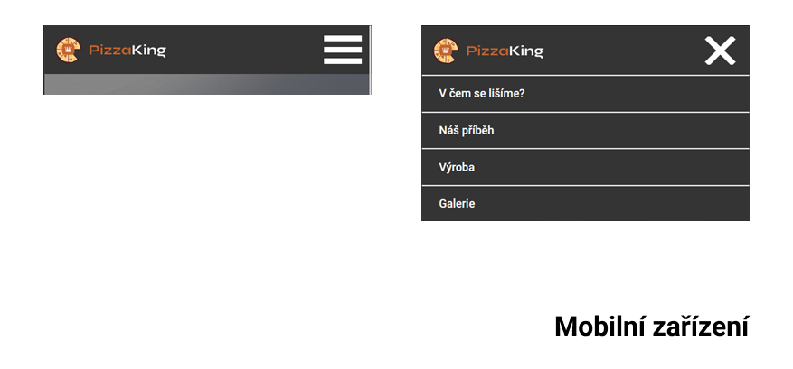
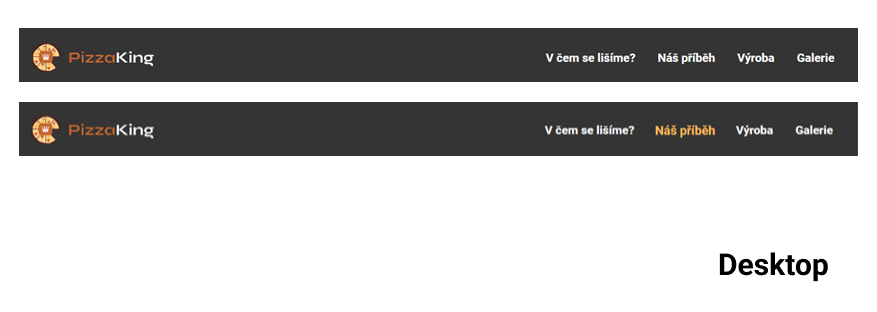

# Zadání pro cvičení na responzivní menu
Stáhněte si podkladový kód a vytvořte funkční responzivní menu využívající ID. Nepřepisujte už předpřipravený kód. Veškeré potřebné barvy jsou uvedeny v: root a využívejte je pomocí proměnných (var()). Vzhled správného řešení najdete v předpřipraveném kódu ve složce reseni a pod tímto textem.
(v rámci cvičení nezáleží na přesném paddingu prvků, stačí ho zvolit tak aby vizuálně odpovídal řešení)

